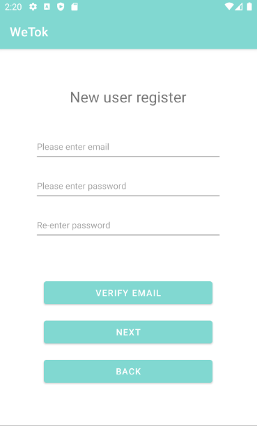
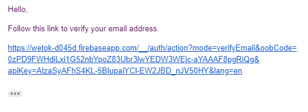
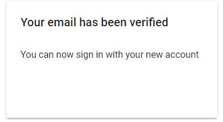
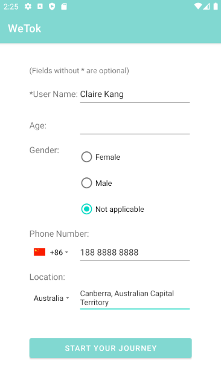
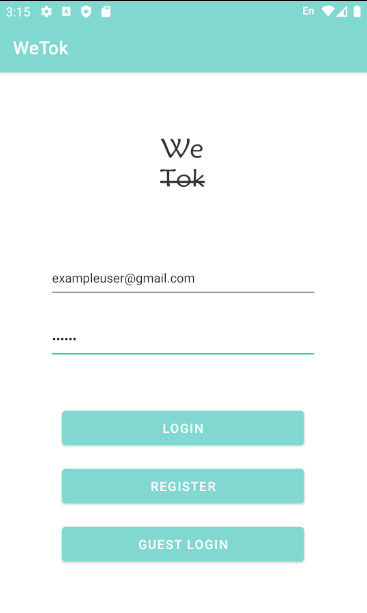
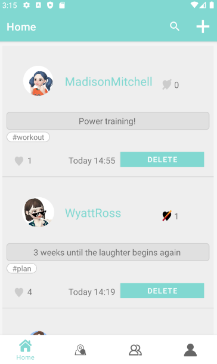
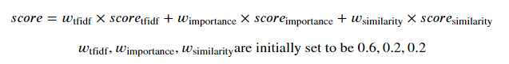
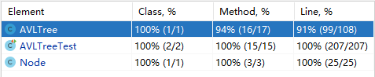

# WeTok Report

The following is a report template to help your team successfully provide all the details necessary for your report in a structured and organised manner. Please give a straightforward and concise report that best demonstrates your project. Note that a good report will give a better impression of your project to the reviewers.

*Here are some tips to write a good report:*

* *Try to summarise and list the `bullet points` of your project as much as possible rather than give long, tedious paragraphs that mix up everything together.*

* *Try to create `diagrams` instead of text descriptions, which are more straightforward and explanatory.*

* *Try to make your report `well structured`, which is easier for the reviewers to capture the necessary information.*

*We give instructions enclosed in square brackets [...] and examples for each sections to demonstrate what are expected for your project report.*

*Please remove the instructions or examples in `italic` in your final report.*

## Table of Contents

- [[WeTok] Report](#we-report)
  - [Table of Contents](#table-of-contents)
  - [Team Members and Roles](#team-members-and-roles)
  - [Conflict Resolution Protocol](#conflict-resolution-protocol)
  - [Application Description](#application-description)
    - [Application Use Cases and or Examples](#application-use-cases-and-or-examples)
  - [Application UML](#application-uml)
  - [Application Design and Decisions](#application-design-and-decisions)
    - [Data Structures](#data-structures)
      - [AVL Tree](#avl-tree)
    - [Design Patterns](#design-patterns)
      - [(i) Singleton](#singleton)
      - [(ii) Template](#template)
      - [(iii) DAO](#dao)
    - [Grammars](#grammars)
    - [Tokenizer and Parsers](#tokenizer-and-parsers)
    - [Surpise Item](#surpise-item)
      - [(i) Ranking algorithm](#ranking-algorithm)
      - [(ii) Simple personalisation](#simple-personalisation)
  - [Summary of Known Errors and Bugs](#summary-of-known-errors-and-bugs)
  - [Testing Summary](#testing-summary)
    - [(i) AVL Tree Testings](#avl-tree-testings)
    - [(ii) Dao and Bean Testings](#dao-and-bean-testings)
    - [(iii) Parser and Tokenizer Tests](#tokenizer-and-parser-testings)
    - [(iv) Ranking Tests](#ranking-testings)
  - [Implemented Features](#implemented-features)
  - [Team Meetings](#team-meetings)

## **Team Members and Roles**

| UID | Name | Role |
| :--- | :----: | :--- |
| u6120911 | Xinyu Kang | Integration Engineer, Data Structure Designer, Ranking Algorithm Designer |
| u7151386 | Xinyue Hu | Database Designer, Data Structure Designer, Integration Engineer |
| u6684233 | Yuxin Hong | Tokenizer and Parser Designer, Bug Killer |
| u6111569 | Zhaoting Jiang | UI Designer, Fragment designer |

## **Conflict Resolution Protocol**

1. Conflictors organize their views, list the pros and cons of their choice.
2. Initiate a zoom meeting with all team member.
3. Conflictors presenting the confliction and why disagree with the others.
4. Team member do a vote and share the reason.
5. As a result, merge conflictors's solutions or take more agreed solutions.

## **Application Description**

* **Wetok is a social media app specifically aimed at person with a strong personality. You can share your status and mood with your friends, people in the same city, and even strangers anytime, anywhere. In here, you do not have to worry about cyber-violence and personal abuse, we only provide you with a pure sharing platform. As our logo shows, we talk, but we don't comment. Furthermore, you can search for tags you're interested in and subscribe people that you're interested in. You can understand what is happening in this world through wetok. Welcome to Wetok.** 

### **Application Use Cases and or Examples**

Targets Users: Everyone who is willing to use and learn about this app

* *Users can use it to post whatever they want to say.*
* *Users can use it to find the post nearby them.*
* *Users can use it to delete their post whenever they want to.*
* *Users can use it to like others' post.*
* *Users can use it to dislike others' post.*
* *Users can use it to follow the person that they are interested in.*

Jack wants to learn about skateboarding skills that interest him most
1. Jack searched the tag about skateboarding and found that Kevin shared skateboarding skills every day
2. He followed Kevin
3. He learned new moves from Kevin's skateboard skills

Andy wants to know about the good restaurants around him
1. Andy turns on the City feature and finds that Claire shared a delicious restaurant nearby
2. He press the like button for that post.
3. He followed Claire and hope Claire can share more delicious restaurants in the future

Stan wants to delete his post
1. Stan post his relationship with his girlfriend a few weeks ago
2. He broken up with his girlfriend yesterday
3. He found his previous post in the user session
4. He deleted his post

#### **New User Register**
1. Click *REGISTER* in the login page, go to register page:    
  

2. Enter a valid email (gmail is recommended) and your password, click *VERIFY EMAIL* and the system will remind you that "Verification email sent. Please verify your email to continue". Then check your mailbox and click the varification link:    
 

3. After successfully varified your email, click *NEXT* and go to user information register page. All the fields are optional except for the username. You can select the country for your phone number and address.   
  
You can only enter several characters of your city's name, then you can choose your city from the system's recommendations. 

4. The final step is to click *START YOUR JOURNEY* and you will go to the main page. 

#### **Existing User Login and Other Operations**
1. Here we provide an example user: email = [exampleuser.gmail.com], password = [123456]    
  
2. After you logged in, there've entered the home page of the app:     
  

## **Application UML**

*[Replace the above with a class diagram. You can look at how we have linked an image here as an example of how you can do it too.]*

## **Application Design and Decisions**

*Please give clear and concise descriptions for each subsections of this part. It would be better to list all the concrete items for each subsection and give no more than `5` concise, crucial reasons of your design. Here is an example for the subsection `Data Structures`:*

*I used the following data structures in my project:*

### Data Structures
#### AVL Tree

   * *Objective: It is used for storing xxxx for xxx feature.*

   * *Locations: line xxx in XXX.java, ..., etc.*

   * *Reasons:*

     * *It is more efficient than Arraylist for insertion with a time complexity O(1)*

     * *We don't need to access the item by index for this feature*

##### Design Patterns
1. Singleton
   * Objective: It is used for making sure of that there is exactly one instance of the current user

   * Locations: *CurrentUser.java*

   * Reasons:

     * It can effectively avoid the case of multiple-current-users error
     * We need a class storing the current user instance that can be access from the whole project

#### Template
   * Objective: It is used for computing the ranking scores of the retrieved posts from different dimensions.

   * Locations: *ScoreTemplate.java* (abstract class), *RelevanceScore.java* (concrete class), *ImportanceScore.java* (concrete class), *UserSimilarity.java* (concrete class)

   * Reasons:

     * We want to sort the posts based on three criteria. There is a common process (i.e., calculate scores, normalize scores) to scoring the posts but each criterion has its own scoring logic. 
     * The template method can clearly define the structure and make the code more readable and reuseable. 

#### DAO
   * Objective: It is used for storing the users and posts data read from persistent files.

   * Locations: *UserDao.java*, *PostDao.java*

   * Reasons:

     * We want to decouple domain logic from persistence mechanisms and avoid exposing details of the data storage.
     * The DAO method allows JUnit test to run faster as it allows to create Mock and avoid connecting to database to run tests.

### Grammars
   * Objective: Process multiple condition at once with *AND* and *OR* operator.

   * Locations: *Parser.java*.

   * Reasons: Process multiple-tag search.

### Tokenizer and Parsers
   * Objective: Parse expression in tokens: *TAG, AND, OR, LBRA, RBRA*. Search multiple tag at once with *AND* and *OR* operator.  

   * Locations: *Tokenizer.java*, *Parser.java*. 

   * Reasons: Process multiple-tag search.

### Surpise Item
#### Ranking algorithm
   * Objective: It is used for ranking the retrieved posts

   * Locations: Package *ranking* : *Rank.java*, *ScoreTemplate.java*, *RelevanceScore.java*, *ImportanceScore.java*, *UserSimilarityScore.java*

   * Reasons:
     * This is an interesting feature and closely related to society
     * We want to rank the retrieved posts based on more than the post time
     * There are members in our group who have learned information retrieval

2. Simple personalisation
   * Objective: It is used for logging users' addresses to improve the timeline creation

   * Locations: Package *view* : Package *fragment* : "CityFragment.java*

   * Reasons:
     * This is the simplest way to personalise the timeline creation.
     * We have thought about maximising the chances of  accurately providing search results or information in a timeline by using user posts, user interactions and so on. 
     * However, in the ranking algorithm we considered the similarity between the current user of the sender of the posts as a negative factor of search ranking to break *Filter Bubbles*. We do not want to "offset" the effect of the ranking algorithm.
     * So, in our app the users can choose to enable (by click on *city* in the navigation bar) or unable the simple location personalisation according to their preferences . 
### **Data Structures**

##### **AVL Tree**

We selected AVL tree as the data structure of posts operations. AVL tree is a self-balancing binary search tree. It controls the height of the tree and prevents it from becoming skewed. For operations considered they have time complexity:
- Rotations to achieve balanced tree *O(1)*
- Insertion *O(log(n))*
- Deletion *O(log(n))*
- Search *O(log(n))*
- Max/Min *O(log(n))*

It is an efficient data structure and here is the UML of our implementation: 
    

### **Design Patterns**

We used three design patterns: Singleton, Template, DAO
##### **Singleton**
   * Location: *CurrentUser.java*
   * We used Singleton design pattern in CurrentUser to make sure there must be exactly one instance of the current user.  
    

##### **Template**
   *  Location: *ScoreTemplate.java* (abstract class), *RelevanceScore.java* (concrete class), *ImportanceScore.java* (concrete class), *UserSimilarity.java* (concrete class)
   *  We want to sort the posts based on three criteria. There is a common process (i.e., calculate scores, normalize scores) to scoring the posts but each criterion has its own scoring logic. 
   *  So, we used a score template to define the skeleton of the scoring algotirthm, and let subclasses redefine certain steps of the algotirthm without changing the main structure.  
    

##### **DAO**
   * Location: *UserDao.java*, *PostDao.java*
   * We want to decouple domain logic from persistence mechanisms and avoid exposing details of the data storage. The two DAO classes provided convenient access to user data in whole project.   
    

### **Grammars**

  *Production Rules*  
\<exp> ::= \<term> | \<term> '|' \<exp> 

\<term> ::= \<factor> | \<factor> '&' \<term> 

\<factor> ::= \<tag> | '(' \<exp> ')' 

According to this gramma, we can parse *AND* and *OR* operations. For example, suppose we have the expression **condition1 & condition2 | condition3**, human will process it as **(condition1 & condition2) | condition3**, so does our gramma will do. Another example is **condition1 & (condition2 | condition3 & condition4)**, human will process it as **condition1 & (condition2 | (condition3 & condition4))**, so does our gramma will do. In application, the advantages of our gramma is to filter tag of post with *AND* and *OR* operation. It takes tag as its condition and only return post that satified given condition in expression.

### **Tokenizer and Parsers**
Generally speaking, the advantages of our design is we to search multiple tags at once and this is also the design approach of our gramma. Operations *AND* and *OR* can be aplied on multiple tags search, that is, the intersection and union of single search result. By search *#tag1&#tag2*, the intersection of individual search result of *#tag1* and *#tag2* will be returned. By search *#tag1|#tag2*, the union of of individual search result of *#tag1* and *#tag2* will be returned. And of course the operators can be freely used to create more expressions. By default, the precedence of *AND* operation is greater then *OR* operation. And precedence can be changed parentheses *LBRA* and *RBRA*.

### **Surpise Item**
##### **Ranking algorithm**
Based on the *Pariser talk*, we decided to sort the posts by three criteria: relecvance; importance; user similarity. 
* **Relevance** 
  The class *RelevanceScore* evaluates the relecance of the query and the retrieved posts by calculating tf-idf scores. The score of post d given query q = (t_1, t_2, ..., t_m) is:  
   
  We expect the posts containing more "rare words" that appeared in the query to be more relevant. The rare word here refers to the word that does not exist in many posts.  
 
* **Importance** 
  The class *ImportanceScore* evaluates the importance of the retrieved posts by calculating the post time, post likes, and the user's followers: 
   
  We expect the posts with more likes, the posts sent by users with more followers, and the latest posts to be more important to society, and thus have higher ranking scores.  
 
* **User Similarity** 
  The class *UserSimilarityScore* evaluates the similarity of the current user and the senders of the posts by evaluating their subscribers, posts, and addresses: 
     
  The post sent by the user who is considered as more 'similar' with the current user will have a lower ranking score.We expect to use this algotithm to offset some negative effects of the *'Filter Bubbles'*.   
 
* **Overall Score** 
  
   
  All of the weights introduced in this algorithm were intuitively chose by our group members. In practice we should use machine learning techniques to train the best weights. 
  We expect that the posts having strong relevance with the query, the posts which are important to society, and the posts sent by the users who are "different" with the user, to have better ranking in the search results presenting. 
  More and more intelligent recommendation systems create the *'Filter Bubbles'* for users. We intend to "break" the bubble by implementing the ranking algorithm from users similarity dimension. The score of the posts created by the users who are very "similar" with you will be scaled down. People will have more chances to receive different viewpoints from social media.  

##### **Simple personalisation**
*In order to create unique personalization features, we recorded the location of the user while recording the user login data. Based on the user's location, we added a search function, which is the city search function. The local search function searches for all posts in the same city based on the current user's location. This will make it easier for users to see what's going on around them.*

## **Summary of Known Errors and Bugs**

*[Where are the known errors and bugs? What consequences might they lead to?]*

*Here is an example:*

1. *Bug 1:*

- *A space bar (' ') in the sign in email will crash the application.*
- ... 

2. *Bug 2:*
3. ...

*List all the known errors and bugs here. If we find bugs/errors that your team do not know of, it shows that your testing is not through.*

## **Testing Summary**

### **AVL Tree Testings**
Number of test cases: 13  
     

Code coverage:  
     

Types of tests created: 
1. *sameKeyInsertTest* : test whether the AVL tree can insert multiple values into one nodes
2. *insertInOrderTest* : test whether the AVL tree can correctly insert nodes in order
3. *leftRotateTest* : test whether the AVL tree can correctly left rotate
4. *rightRotateTest* : test whether the AVL tree can correctly right rotate
5. *balanceFactorTest* : test whether the class can generate correct balance factors
6. *advancedRotationsTest* :  test whether the AVL tree can handle complex rotations
7. *deleteNotExistException* : test whether the AVL tree can throw an exception when deleting a node that not exists
8. *deleteLeafTest* : test whether the AVL tree can delete a leaf node
9. *deleteSingleChildNodeTest* : test whether the AVL tree can correctly delete a node with one child
10. *deleteTwoChildrenNodeTest* : test whether the AVL tree can correctly delete a node with two children 
11. *deleteRootTest* : test whether the AVL tree can correctly delete the root node 
12. *searchByKeyTest* : test whether the AVL tree can correctly find the node based on the key 
13. *searchByNotExistKeyTest* : test whether the AVL tree returns null when searching a key that not exists 

### **Dao and Bean Testings**
Number of test cases: 14  
     

Code coverage:  
     

Tests created for Bean:
1. *userEmptyTest* : test whether all the setter and getter in User class are valid.
2. *constructorTest* : test whether the constructor in User class is valid.

Tests created for Dao:
1. *getTagListTest* : test whether the PostDao can get all the tags in posts.
2. *findInsertIndexTest* : test whether the PostDao can find the right place to insert post.
3. *addPostTest* : test whether the PostDao can add a post to database.
4. *getPostsTest* : test whether the PostDao can get all the posts in database.
5. *findUserByEmailTest* : test whether the UserDao can find the right user by it's email.
6. *findUserByIdTest* : test whether the UserDao can find the right user by it's user id.
7. *setFriendsTest* : test whether the UserDao can set friends for corresponding user.
8. *setFollowersTest* : test whether the UserDao can set followers for corresponding user.
9. *setSubscribersTest* test whether the UserDao can set subscribers for corresponding user.
10. *getPostsTest* : test whether the UserDao can get all the posts of each user.
11. *setPostInfoTest* : test whether the UserDao can instantiate each user's post.
12. *addUserTest* : test whether the UserDao can add user to database.

### **Parser and Tokenizer Tests**
Number of test cases: 12  
     

Code coverage:  
     

Tests created for Tokenizer: 
1. *testAndToken* : test whether *AND* token can be recogize.
2. *testOrToken* : test whether *OR* token can be recogize.
3. *testFirstToken* : test whether first *LBRA* token can be recogize.
4. *testMidTokenResult* : test whether *TAG* and *OR* token at middle can be recogize.
5. *testAdvancedTokenResult* : test whether tokens from *(#weekend | #mood) & #time* can be tokenized.
6. *testExceptionToken* :  test whether tokenizer throw exceptions as expected.

Tests created for Parser: 
1. *testSingleTag* : test whether single-tag-search is correct.
2. *testSimpleAnd* : test whether search tag with *AND* operation is correct.
3. *testSimpleOr* : test whether search tag with *OR* operation is correct.
4. *testSimpleCase* : test whether search tag with multiple *AND* operations is correct.
5. *testMidCase* : test whether search tag with *AND* and *OR* operations is correct.
6. *testIllegalProductionException* :  test whether parser throw exceptions as expected.

### **Ranking Tests**
Number of test cases: 8  
     

Code coverage:  
     

Tests created for Ranking Tests: 
1. ImportanceScoreTest: 3 tests for 3 component of calculating importance score: time, like, follower.
2. RelevanceScoreTest: 2 tests for 1 tag relevent and 2 tags relevant.
3. UserSimilarityScoreTest: 3 tests for 3 component of calculating user similarity score: location, subscriber, post.

## Implemented Features

*Improved Search*

1. *Search functionality can handle partially valid and invalid search queries. (medium)*

*UI Design and Testing*

1. *UI must have portrait and landscape layout variants as well as support for different screen sizes. Simply using Android studio's automated support for orientation and screen sizes and or creating support without effort to make them look reasonable will net you zero marks. (easy)*

*Greater Data Usage, Handling and Sophistication*

1. *User profile activity containing a media file (image, animation (e.g. gif), video). (easy)*
2. *Deletion method of either a Red-Black Tree and or AVL tree data structure. The deletion of nodes must serve a purpose within your application (e.g. deleting posts). (hard)*

*User Interactivity*

1. *The ability to micro-interact with 'posts' (e.g. like, report, etc.) [stored in-memory]. (easy)*
2. *The ability for users to ‘follow’ other users. There must be an adjustment to either the user’s timeline in relation to their following users or a section specifically dedicated to posts by followed users. [stored in-memory] (medium)*

*User Interactivity*

1. *Use Firebase to implement user Authentication/Authorisation. (easy)*

## Team Meetings

- *[Team Meeting 1](./Meeting1.md)*
- *[Team Meeting 2](./Meeting2.md)*
- *[Team Meeting 3](./Meeting3.md)*
- *[Team Meeting 4](./Meeting4.md)*
